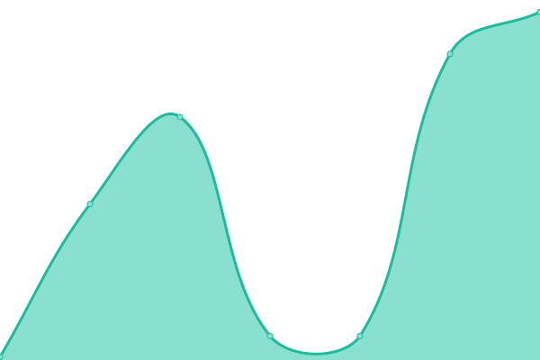

# [📈 Uptime Monitor](https://monitor.aliqbal.net)

<!--start: status pages-->
<!-- This summary is generated by Upptime (https://github.com/upptime/upptime) -->
<!-- Do not edit this manually, your changes will be overwritten -->
<!-- prettier-ignore -->
| URL | Status | History | Response Time | Uptime |
| --- | ------ | ------- | ------------- | ------ |
|  MAINK | 🟥 Down | [maink.yml](https://github.com/iqbalbinsb/monitor/commits/HEAD/history/maink.yml) | 

 67ms
     
 | 

<a href="https://monitor.aliqbal.net/history/maink">0.00%</a>
    

|  STATK | 🟥 Down | [statk.yml](https://github.com/iqbalbinsb/monitor/commits/HEAD/history/statk.yml) | 

 75ms
     
 | 

<a href="https://monitor.aliqbal.net/history/statk">0.23%</a>
    

|  CTTNK | 🟥 Down | [cttnk.yml](https://github.com/iqbalbinsb/monitor/commits/HEAD/history/cttnk.yml) | 

 58ms
     
 | 

<a href="https://monitor.aliqbal.net/history/cttnk">0.13%</a>
    

|  WWWMK | 🟩 Up | [wwwmk.yml](https://github.com/iqbalbinsb/monitor/commits/HEAD/history/wwwmk.yml) | 

 2548ms
     
 | 

<a href="https://monitor.aliqbal.net/history/wwwmk">100.00%</a>
    

|  CONSOLE-IDCH | 🟩 Up | [console-idch.yml](https://github.com/iqbalbinsb/monitor/commits/HEAD/history/console-idch.yml) | 

 234ms
     
 | 

<a href="https://monitor.aliqbal.net/history/console-idch">100.00%</a>
    

<!--end: status pages-->

[**Visit monitor page →**](https://monitor.aliqbal.net)

## 📄 License

- Powered by: [Upptime](https://github.com/upptime/upptime)
- Code: [MIT](./LICENSE) © [iqbal](https://monitor.aliqbal.net)
- Data in the `./history` directory: [Open Database License](https://opendatacommons.org/licenses/odbl/1-0/)
